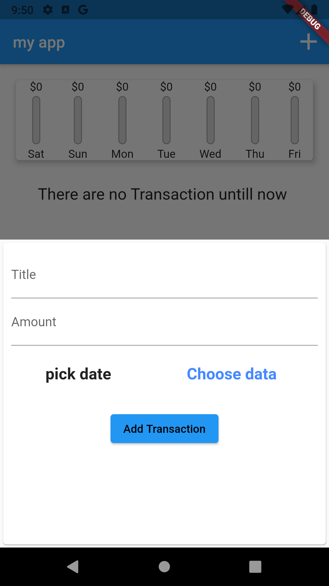

# personal_expenses

A new Flutter project. that i make to learn the flutter  and the Dart language base on udemy course named *** Flutter & Dart - The Complete Guide 2021 Edition ***

## what do i learn by bulding this project ?

1. styling the Widget and make the themes
2. alot of Widget like 
  * FittedBox
  * SizedBox
  * Row
  * TextField
  * SingleChildScrollView
  * ListView
  * FractionallySizedBox
3. work with intl package 

# Image

### still to go later ,
1. make the app Responsive & Adaptive 
2. more styling 
3. add backend server and databace 

